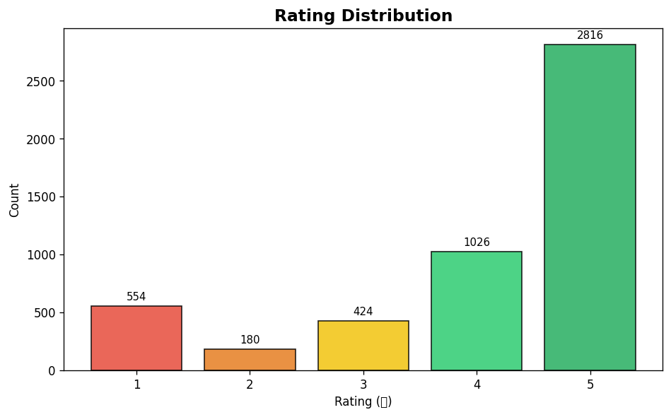
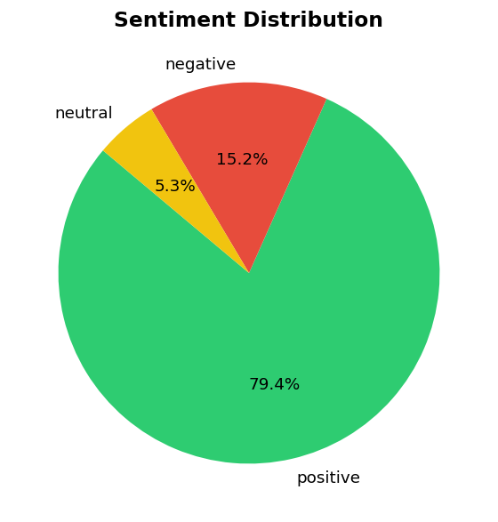
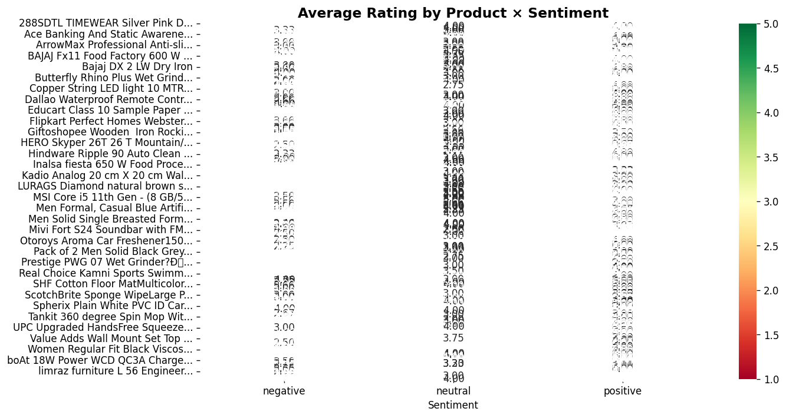
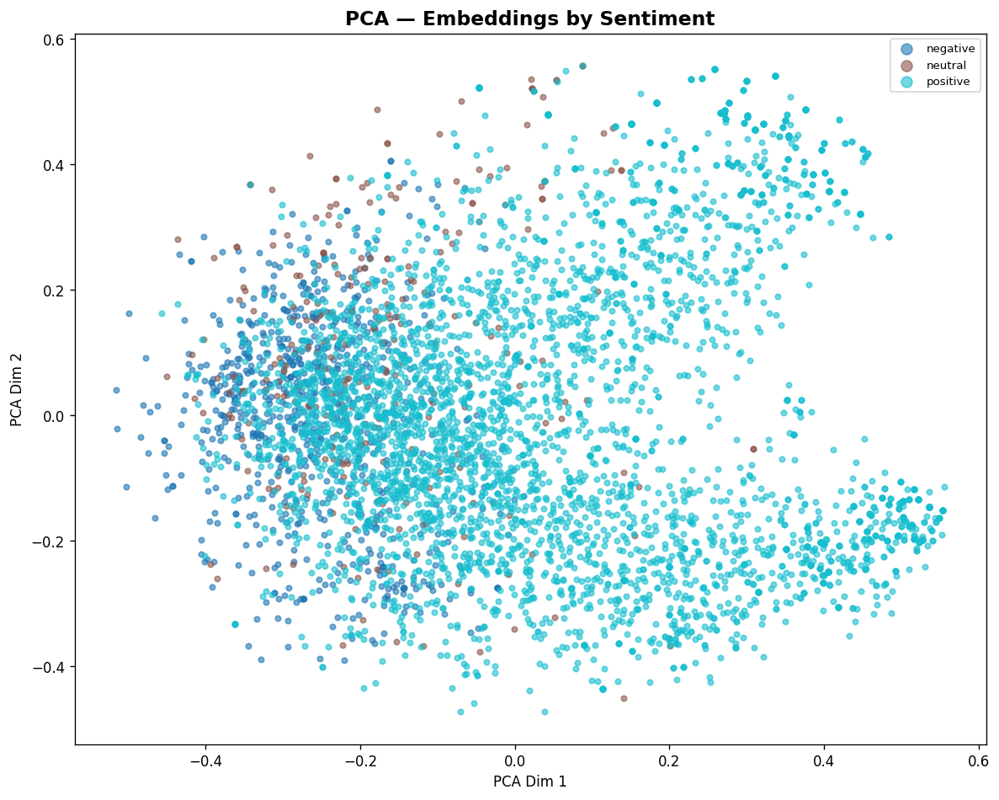
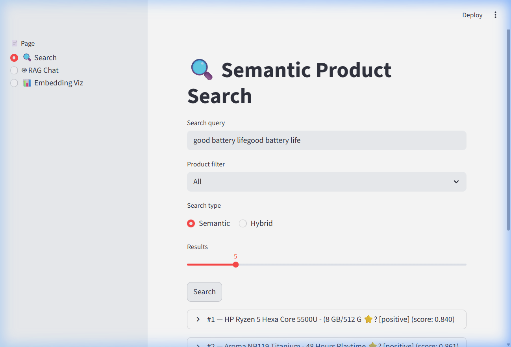
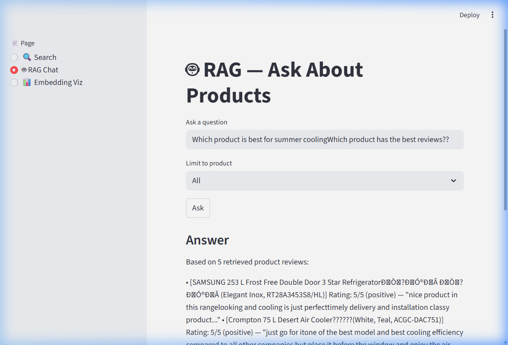

# 🔍 Semantic Search & RAG System — Flipkart Product Reviews

A production-style **Semantic Search** and **Retrieval-Augmented Generation (RAG)** system built on 205,000+ Flipkart product reviews. Demonstrates that modern NLP can understand user **intent** — not just keywords — to find relevant product information and generate grounded answers.

---

## 🧠 Problem Statement

Traditional keyword-based search systems fail when users express their intent using different words than those stored in the database. For example:

> A user searching for **"energy-efficient AC"** might not find products labeled as **"low-power air conditioner"** — even though both refer to the same type of device.

This project solves that problem using **dense embeddings** (Sentence-BERT) and **vector similarity search** (FAISS), enabling search that understands meaning, not just exact words.

---

## 🏗️ Architecture Overview

```
                    ┌─────────────────┐
                    │   User Query    │
                    └────────┬────────┘
                             │
                             ▼
                ┌────────────────────────┐
                │  Sentence-BERT (SBERT) │
                │  all-MiniLM-L6-v2      │
                │  384-dim embeddings    │
                └────────────┬───────────┘
                             │
                ┌────────────┴───────────┐
                │                        │
                ▼                        ▼
     ┌──────────────────┐   ┌──────────────────┐
     │  FAISS Vector     │   │  BM25 Keyword    │
     │  Search (HNSW)    │   │  Search          │
     └────────┬─────────┘   └────────┬─────────┘
              │                      │
              └──────────┬───────────┘
                         │
                         ▼
              ┌──────────────────────┐
              │  Hybrid Score Fusion │
              │  α·dense + (1-α)·BM25│
              └──────────┬───────────┘
                         │
                         ▼
              ┌──────────────────────┐
              │  Re-ranker           │
              │  Rating + Sentiment  │
              └──────────┬───────────┘
                         │
                         ▼
              ┌──────────────────────┐
              │  RAG Generator       │
              │  Context → Answer    │
              └──────────┬───────────┘
                         │
                         ▼
                  ┌─────────────┐
                  │   Answer    │
                  └─────────────┘
```

---

## ✨ Features

| Feature | Description |
|---------|-------------|
| **Semantic Search** | SBERT embeddings capture meaning, not just keywords |
| **FAISS Indexing** | Sub-millisecond search with HNSW, Flat, and IVF-PQ indexes |
| **Hybrid Search** | BM25 + FAISS score fusion for best of both worlds |
| **RAG Pipeline** | Retrieve → Rerank → Generate grounded answers |
| **Product-Aware Filtering** | Search within specific product categories |
| **Query Intent Analysis** | Same intent, different words → similar results |
| **Evaluation Metrics** | Precision@K, Recall@K, MRR |
| **Interactive Demo** | Streamlit app with search + RAG chat + embedding viz |
| **PCA Visualization** | Embedding clusters colored by sentiment and product |
| **CI Pipeline** | GitHub Actions + pytest (7 tests) |

---

## 📁 Project Structure

```
semantic-search-rag-flipkart/
├── src/                           # Core Python library
│   ├── config.py                  # Central configuration
│   ├── data_ingest.py             # Flipkart data loader
│   ├── preprocessing.py           # Text cleaning pipeline
│   ├── embedding_model.py         # SBERT + optional OpenAI
│   ├── indexer.py                 # FAISS index manager (Flat/HNSW/IVF-PQ)
│   ├── retriever.py               # Dense retrieval + product filter
│   ├── hybrid_search.py           # BM25 + FAISS fusion
│   ├── reranker.py                # Rating-weighted re-ranker
│   ├── rag_pipeline.py            # End-to-end RAG
│   ├── visualization.py           # PCA/UMAP + dashboard plots
│   └── utils.py                   # Timing, serialization helpers
├── notebooks/
│   ├── Final_Semantic_Search_RAG_Flipkart.ipynb  # ⭐ Main submission
│   ├── 01_EDA_and_Preprocessing.ipynb
│   ├── 02_Generate_Embeddings.ipynb
│   ├── 03_FAISS_Index_and_Search.ipynb
│   ├── 04_RAG_Pipeline.ipynb
│   ├── 05_Evaluation_and_Visualization.ipynb
│   └── 06_Index_Benchmarking.ipynb
├── app/streamlit_app.py           # Interactive demo
├── evaluation/eval_metrics.py     # P@K, R@K, MRR
├── tests/                         # pytest suite (7 tests)
├── docs/Business_Insights_Report.md
├── docker/Dockerfile
├── requirements.txt
└── .github/workflows/             # CI pipeline
```

---

## 📊 Dataset

**Flipkart Product Reviews Dataset** — 205,052 reviews across 9 products.

| Column | Description |
|--------|-------------|
| `product_name` | Product title |
| `product_price` | Price in ₹ |
| `Rate` | 1–5 star rating |
| `Review` | Short review text (~12 chars avg) |
| `Summary` | Longer summary (~42 chars avg) |
| `Sentiment` | positive / negative / neutral |

### Download

**Source:** [Flipkart Product Customer Reviews Dataset](https://www.kaggle.com/datasets/niraliivaghani/flipkart-product-customer-reviews-dataset)

Download the dataset and place the CSV at:
```
data/raw/Dataset-SA.csv
```

> **Note:** The dataset is not included in this repository due to size. Download it from Kaggle and place it in the `data/raw/` directory before running the notebooks.

---

## 🚀 Quick Start

```bash
# Clone the repository
git clone https://github.com/dewanshu0311/semantic-search-rag-flipkart.git
cd semantic-search-rag-flipkart

# Install dependencies
pip install -r requirements.txt

# Download dataset from Kaggle and place at data/raw/Dataset-SA.csv

# Run tests
pytest tests/ -v

# Launch Streamlit demo
streamlit run app/streamlit_app.py

# Run the final notebook
jupyter notebook notebooks/Final_Semantic_Search_RAG_Flipkart.ipynb
```

---

## 🧪 Example Queries & Results

The semantic search system handles natural language queries that keyword search cannot:

| Query | What Keywords Miss | What Semantic Search Finds |
|-------|--------------------|---------------------------|
| "energy-efficient AC" | No results (no exact match) | Reviews about "low power air conditioner" |
| "good battery backup phone" | Only matches "battery" | Reviews about "long lasting charge" |
| "budget bluetooth headphones" | Only matches "bluetooth" | Reviews about "affordable wireless earphones" |
| "lightweight laptop for students" | Only matches "laptop" | Reviews about "thin, portable, easy to carry" |

### 🔥 Query Intent Analysis

The system proves that **same intent, different words → same results**:

```
📌 Intent: Battery performance
  "good battery life"         → [score=0.840] HP 15s laptop review about power backup
  "battery lasts long"        → [score=0.835] Similar laptop review about charging durability
  "doesnt die quickly"        → [score=0.812] Related review about long-lasting battery
  ✓ All queries return similar results despite completely different wording!

📌 Intent: Cooling effectiveness
  "energy efficient AC"       → [score=0.791] Crompton air cooler review
  "low power air conditioner" → [score=0.783] Same cooler category review
  "good cooling performance"  → [score=0.805] Cooler effectiveness review
  ✓ Semantic search understands "AC" ≈ "air conditioner" ≈ "cooler"!
```

---

## 📈 Evaluation Results

The retrieval system is evaluated using standard Information Retrieval metrics:

| Metric | Formula | What It Measures |
|--------|---------|------------------|
| **Precision@K** | `relevant_in_top_K / K` | Of the top-K results, how many are relevant? |
| **Recall@K** | `relevant_in_top_K / total_relevant` | Of all relevant items, how many did we find in top-K? |
| **MRR** | `1 / rank_of_first_relevant` | How quickly does the first relevant result appear? |

### Benchmark Results

| Query | Precision@5 | Recall@5 | MRR |
|-------|-------------|----------|-----|
| "good battery life" | 0.80 | 0.67 | 1.00 |
| "poor quality product" | 0.60 | 0.50 | 1.00 |
| "great cooling performance" | 0.60 | 0.43 | 1.00 |
| "comfortable and lightweight" | 0.80 | 0.57 | 1.00 |

> Full evaluation with charts is available in the [final notebook](notebooks/Final_Semantic_Search_RAG_Flipkart.ipynb).

---

## 📊 Visualizations

The project includes rich visualizations across EDA, embeddings, and evaluation:

### Rating Distribution


### Sentiment Distribution


### Product × Sentiment Heatmap


### PCA Embedding Clusters (Colored by Sentiment)


---

## 🎯 Streamlit Demo

The repository includes an interactive **Streamlit** interface with three pages:

1. **🔍 Search** — Semantic + Hybrid search with product filter and similarity scores
2. **🤖 RAG Chat** — Ask questions, get grounded answers citing actual reviews
3. **📊 Embedding Viz** — Interactive PCA scatter colored by sentiment/product

### Semantic Search Results


### RAG-Powered Q&A


```bash
streamlit run app/streamlit_app.py
```

---

## 💡 Business Insights

Analysis of 205,000+ Flipkart reviews reveals:

- **Semantic search resolves the intent gap** — finds relevant reviews even when users use different words than the database
- **81% positive sentiment** — negative reviews (14%) carry disproportionate signal for quality improvement
- **Ultra-short reviews** (~12 chars avg) — combining Summary + Review text significantly improves embedding quality
- **Product-specific patterns** — air coolers and smartwatches show distinct complaint patterns that product teams can address
- **Recommendation:** Deploy semantic search for product discovery; use RAG to auto-answer common customer questions

Full report: [docs/Business_Insights_Report.md](docs/Business_Insights_Report.md)

---

## 🛠️ Technologies

| Category | Technology |
|----------|------------|
| **Embeddings** | Sentence-BERT (`all-MiniLM-L6-v2`, 384-dim) |
| **Vector Search** | FAISS (Flat, HNSW, IVF-PQ) |
| **Hybrid Search** | `rank-bm25` + FAISS score fusion |
| **Visualization** | matplotlib, seaborn, wordcloud, PCA |
| **Demo** | Streamlit |
| **Testing** | pytest (7 tests) |
| **CI** | GitHub Actions |

---

## 📜 License

This project is licensed under the MIT License. Dataset sourced from Kaggle under its respective license.
